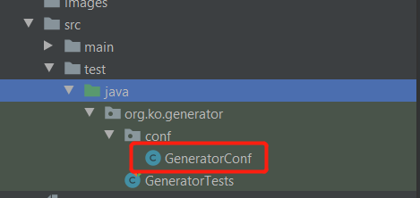
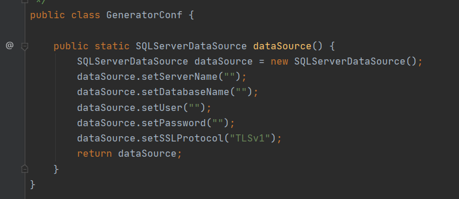

# codegen-luxshare 代码生成工具

- 数据库：SqlServer
- 框架：ASP.NET Core

## 修改配置

- 修改项目`application.yml`配置文件，修改`codegen.path`参数

```yml
# 生成工具配置
codegen.path: C:/Luxshare/Luxshare.Api/Luxshare.Api/
```

- 配置数据源，`src\test\java\org\ko\generator\conf\GeneratorConf.java`





## 启动

- src\test\java\org\ko\generator\GeneratorTests.java，根据需要选择Junit生产代码